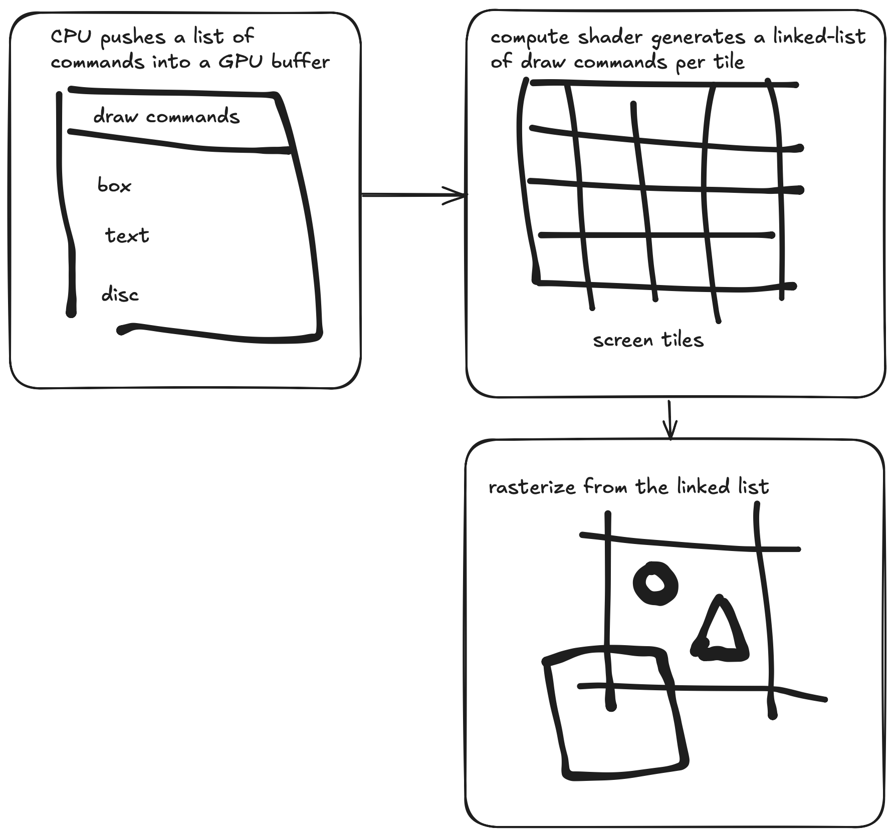

# onedraw — a GPU-driven 2D renderer

| Section | Description |
|---------|-------------|
| [Overview](index.md) | Goals and Initial Architecture |
| [Part 1](part1.md) | Binning commands |
| [Part 2](part2.md) | Hierarchical binning and intrinsic tricks |
| [Part 3](part3.md) | Rasterization |
| [Part 4](part4.md) | Font and textured quads |
| [Part 5](part5.md) | Stats and next steps |
| [API](../lib/onedraw.h) | Header contains doc about the API |
| [FAQ](FAQ.md) | Frequently asked questions |

## Goals and initial architecture

I started the project with the following objectives:

* Not triangle-based: shapes are defined using signed distance functions (SDFs).
* High quality: anti-aliased edges by default, perfectly smooth curves (no tessellation required), optimized for high-resolution displays.
* Fast and GPU-driven: offload as much work as possible to the GPU and minimize draw calls.
* Efficient alpha blending: designed to make extensive use of transparency without significant performance cost.

## Overview

To achieve high performance, `onedraw` minimizes unnecessary computations during rasterization. Since it primarily uses [signed distance functions (SDFs)](https://iquilezles.org/articles/distfunctions2d/) to render shapes—and these functions can be relatively expensive—efficient culling is essential.

The screen is divided into **16×16 pixel tiles**. A **compute shader** builds a **linked list of draw commands per tile**.  
When a tile is rasterized, the fragment shader has direct access to the exact set of draw commands that affect that tile—ensuring that only relevant shapes are processed.

---

## GPU-Driven Pipeline

The entire linked-list generation process happens **on the GPU**.  
If a tile contains one or more draw commands, it’s automatically added to a list of tiles to be rendered.  
Finally, an **indirect draw call** is issued to rasterize only those active tiles—eliminating CPU overhead and allowing fully GPU-driven rendering.

---

[Next part](part1.md) : Binning commands
