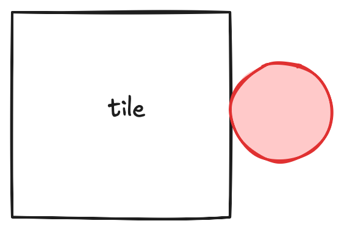
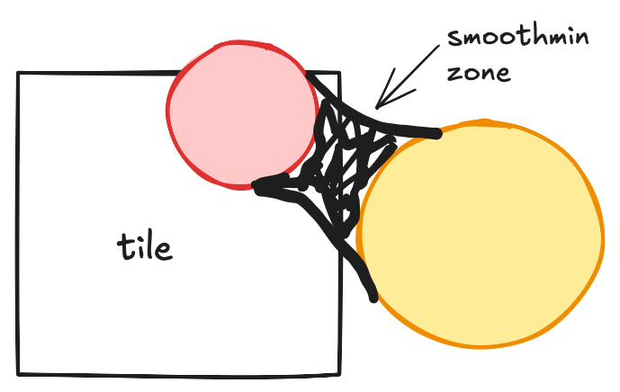

# onedraw — a GPU-driven 2D renderer

## Binning commands

Binning is the process that generates the **per-tile linked lists** of draw commands.  
It works by performing intersection tests between each draw command and the bounding box of every tile.  
Classic intersection methods are used, such as the **Separating Axis Theorem (SAT)** for oriented shapes and **distance-to-center** checks for circular ones.

Some additional factors are also considered:
* anti-aliasing  
* groups of shapes  
* smoothmin  

---

## Anti-aliasing

The width of the anti-aliasing region (defined by the user in `onedraw`) must be taken into account during intersection testing.

In the example above, even if the disc does not mathematically intersect the tile’s bounding box, the anti-aliasing width extends beyond it.  
To avoid visible seams or straight edges along tile borders, the disc is still added to the tile’s linked list so that edge pixels are correctly shaded.
We simply grow the size of the bounding box by the width of the anti-aliasing.

## Group of shapes

`onedraw` supports combining multiple shapes into a **group**.  
A group behaves like a single shape: for example, it can have a global transparency even if it contains multiple layers of shapes, or it can have an outline that applies to the entire group.

Groups are defined by wrapping shapes between **begin group** and **end group** commands.  
The end group command triggers the color output (and, if enabled, the outline).

Each begin/end group command is assigned a **global bounding box** that encompasses all shapes within the group.  
This ensures that both the begin and end commands are included whenever the group affects a tile.  
If a group has no shapes intersecting the tile, the linked list is adjusted to skip that unused group, avoiding unnecessary processing.

---

## Smoothmin

The **smoothmin** operator allows multiple shapes to blend smoothly, even when they don’t intersect.  
The *k-factor* (as described on [Inigo Quilez’s website](https://iquilezles.org/articles/smin/)) controls how far a shape can blend with another.

During binning, the tile’s bounding box is expanded by this value to ensure that shapes contributing to a smooth blend are not missed.

Note : this is a very conservative way to handle smoothmin. We might revisit this with some interval arithmetic logic (see [https://www.mattkeeter.com/research/mpr/](https://www.mattkeeter.com/research/mpr/) ) but here are some quick thoughts:
* we don't support complex tree of boolean operations, only smoothmin will benefit from interval arithmetic (min is already optimal)
* the binning shader is already VGPR bound, so adding interval evaluation for all kind of primitives will have an impact on performances even when not using smoothmin
* one solution to explore is an hybrid approach : interval evaluation on CPU that change the aabb tested on the GPU

---

[Next part](part2.md) : Hierarchical binning and intrinsic tricks
