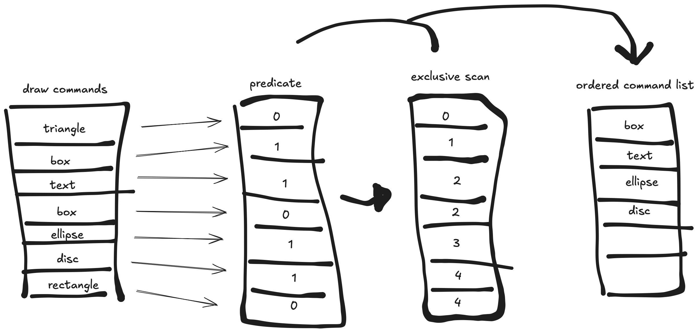

# onedraw — a GPU-driven 2D renderer

## Performance considerations

Even though binning is performed on the GPU, it’s not free. Let’s look at the numbers:

* At 1440p, the screen contains **160 × 90 = 14,400 tiles**
* `onedraw` supports up to **65,536 draw commands**
* In the worst case, that’s around **943 million** intersection tests

With such a naïve approach, the binning step could easily cost more than the actual rasterization. 😬

---

## Quantized AABB

The first optimization is to store an **AABB** (axis-aligned bounding box) for each command and use it as a quick pre-test before running more complex intersection math.  
The bounding boxes are **quantized** to the tile resolution (16 pixels), making the test extremely fast and simple.  

Additionally, the AABBs are stored in a separate buffer from the draw commands to avoid **cache thrashing** and improve memory access efficiency.

---

## Hierarchical binning

Even with AABB pre-tests, having many commands means each tile still performs a significant amount of work.  
To reduce this, we introduce **hierarchical binning** — pre-building a list of commands for larger screen regions.

A region covers **16 × 16 tiles**, and each region keeps a list of the commands that affect it.  
When binning individual tiles, we only consider the commands from that region’s list instead of all global commands.

This sounds great, but there’s a catch:
When binning commands for the region in a compute shader, if we assign one thread per region, it becomes very slow — there are relatively few regions but potentially many commands. GPUs perform best when running **a large number of lightweight threads**, not a few heavy ones.

To fix this, we **invert the process**: each thread processes a single command and adds it to the region lists it intersects.  
However, since this happens in parallel, we lose the guaranteed **ordering of commands**, which is critical in 2D rendering.

## Predicate + exclusive scan

To keep the order of commands, we use the classic pattern :

* A **predicate compute shader** evaluates the visibility of each command (one thread per command) and writes the result — `0` or `1` — to a buffer.  
* An **exclusive scan compute shader** then processes this buffer to build a compact list of visible command indices.  
* Finally, another compute shader uses this predicate and the indices lists to write the corresponding commands into the output buffer.  
  This approach allows us to keep a **thread-per-command** model while efficiently filtering out invisible ones.

This process is applied for all regions.

## Intrinsics trick

Typically, the exclusive scan pass consists of multiple cascaded compute shaders to produce the final result. In our case, however, since we have a maximum of 65k commands and know the SIMD group size on Apple Silicon, we can perform the entire operation in a single pass using the `simd_prefix_exclusive_sum` function and threadgroup memory.

You can look at the [binning shader](../src/shaders/binning.metal).

---

[Next part](part3.md) : Rasterization