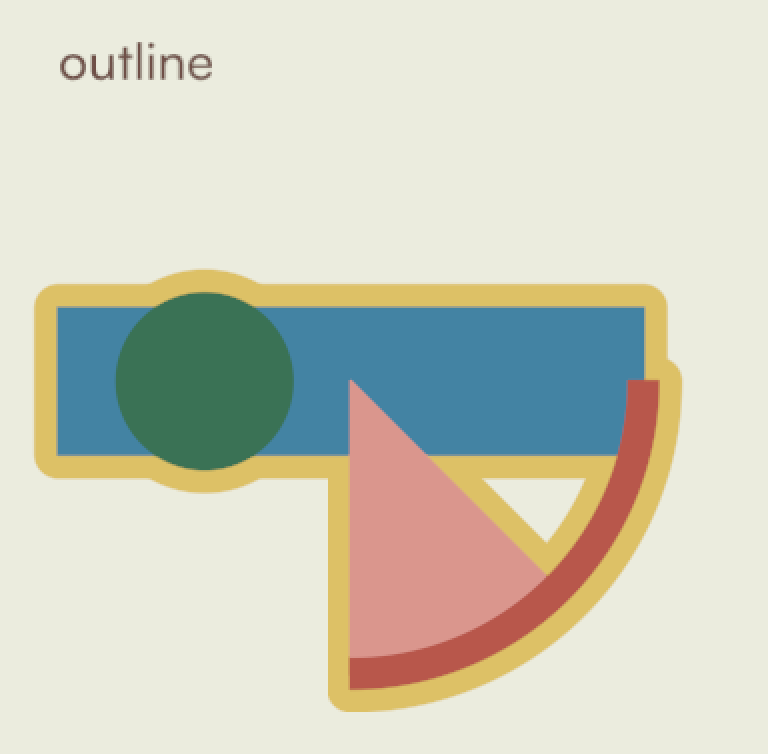
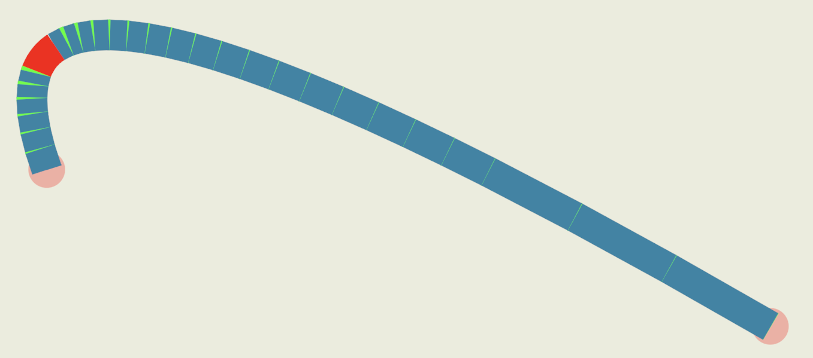
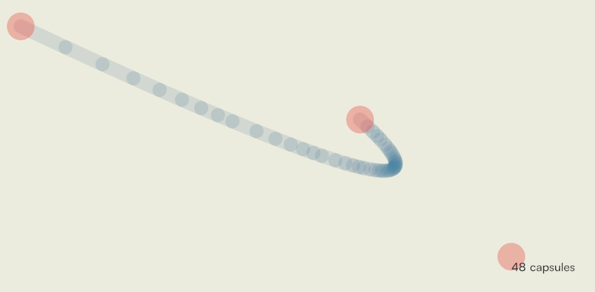

# onedraw — a GPU-driven 2D renderer

## Rasterization shaders


#### Vertex shader

The previous compute shaders produce an array of tile indices.  
An **indirect draw call** then uses this data to determine how many instances to render.  
Each instance corresponds to one tile and is drawn as a **triangle strip** with four vertices.  

In the vertex shader, the tile index is fetched from the array using the **instinstance_id**. 

```C
uint16_t tile_index = tile_indices[instance_id];
uint16_t tile_x = tile_index % input.num_tile_width;
uint16_t tile_y = tile_index / input.num_tile_width;
```

And the final vertex positions are generated based on the **vertex_id**.

```C
float2 screen_pos = float2(vertex_id&1, vertex_id>>1);
screen_pos += float2(tile_x, tile_y);
screen_pos *= TILE_SIZE;
```


We also pass the tile index to each vertex and specify **no interpolation** so the value remains constant across the entire tile.

#### Fragment shader

In the fragment shader, the **tile index** is used to retrieve the linked list of draw commands, which are then processed in order.  
The output color starts with the clear color, and standard **alpha blending** functions are applied to accumulate the final result.  

For **groups of shapes**, the selected operator (`min` or `smoothmin`) is used to accumulate distances and blend colors before contributing to the final output color.

##### Intrinsics

Some values are shared across the quad with the instruction `quad_broadcast` to speed up a little bit (it's visible when profiling but still quite a small optimizations).

## Signed distance functions

We mainly use the the SDF from Inigo Quilez's [website.](https://iquilezles.org/articles/distfunctions2d/)  
The ellipse SDF is taken from this [shadertoy from quagnz](https://www.shadertoy.com/view/tt3yz7).  
And the gaussian blurred box is inspired by [oneshade's shader](https://www.shadertoy.com/view/NsVSWy)  

For the smooth minimum, we use the [quadratic polynomial](https://iquilezles.org/articles/smin/) version that also blend material attribute (in our case color).

## Anti-aliasing

Since rendering operates at the pixel level, there’s no need to compute pixel length using `ddx` or `ddy`.  
Because the alpha transition typically occurs over a very short distance (around one pixel), **linear interpolation** is used instead of `smoothstep`.  

Outlines also use the anti-aliasing technique to smooth both edges — the transition to the background and the transition to the shape’s color.



## Bézier curves

In the beginning, we used the Bézier SDF approach — there are many examples on Shadertoy, [like this one](https://www.shadertoy.com/view/MlKcDD).  
However, two main issues were never properly resolved:

* **Complex math** — especially for cubic Bézier curves. The [bounding box](https://iquilezles.org/articles/bezierbbox/) of a curve is often excessively large, and we end up solving a degree-3 equation for a **lot** of pixels. Culling doesn’t help much in that case.
* **Float precision** — in screen-space coordinates, the math becomes numerically unstable due to limited float precision. There are mitigation techniques, but none are fully robust, and they add both complexity and overhead.


##### Transition to Tesselation

We eventually switched (reluctantly!) to a tesselation-based scheme, which brought one major advantage:  
if we use a cheap primitive to tesselate the curve, then with hierarchical binning we can limit evaluation to just a few SDFs per tile per curve.


##### First Attempt: Biarcs

The first experiments used **biarcs**.  
Arcs worked well for curves, but were unstable for straight parts — the radius would grow beyond float precision.  
To handle that, we switched to **oriented boxes** for the straight sections.  

However, when the stroke width exceeded a dozen pixels, small gaps appeared between boxes due to slight tangent mismatches, even on visually straight segments. To fix this, we added caps (pie SDFs) to fill the gaps.  

For fun, here’s a screenshot of the prototype — biarcs in red, boxes in blue, and small caps (pies) in green:




##### Capsules to the Rescue

This approach was getting expensive!  
Someone suggested switching to **capsules**, and we did exactly that. Capsules are among the cheapest SDFs, and with their “natural” caps they handle tangent differences gracefully — no more gaps.



In this debug view, you can see the overlap between capsules that ensures smooth continuity.

##### Tesselation Details

Tesselation is done using De Casteljau’s algorithm until we reach nearly colinear points (currently the threshold is 1/10th of a pixel).  

Splits are done proportionally to segment lengths, which performs slightly better than a fixed halfway split (`t = 0.5`) but remains cheap.  

We currently support both **quadratic** and **cubic** Bézier curves.


---


[Next part](part4.md) : Font and textured quads


